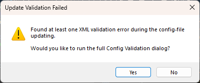

# ConfigUpdater

A Notepad++ Plugin that allows easy interface to be able to update the `langs.xml`, `stylers.xml`, and `themes\` files, based on the most recent Notepad++ release, so that your syntax highlighting will always keep up with improvements.

## Explanation

When Notepad++ updates, it tends to avoid updating important things like `langs.xml`, `stylers.xml`, and your themes; it does this because it doesn't want to overwrite your customizations, but that has the drawback that you end up missing new styles, new languages, and updated keyword lists.

This plugin uses the `langs.model.xml` and `stylers.model.xml` which ship with every copy of Notepad++, and looks for any information that's in the model files, but not in your active config files.  It will copy over that missing information; when you then restart Notepad++, the syntax highlighting and keyword lists will have been updated to include all the settings in your current Notepad++ version.

_NOTE_: Notepad++ v8.8.9 and newer automatically supplies missing styles, languages, and keyword lists from your model files, taking care of the primary feature of this plugin.  But this plugin still does it in bulk (even for inactive themes), and allows you to re-download your model files, and do manual file validation (which is useful when you are developing a new theme).

## Installation

You can install the plugin using Notepad++'s **Plugins Admin**, or by unzipping the appropriate archive from the [latest release](https://github.com/pryrt/NppPlugin-ConfigUpdater/releases/latest), so that `ConfigUpdater.dll` ends up in the `c:\Program Files\Notepad++\plugins\ConfigUpdater\` directory (or equivalent, for your installation's location).  (The files in the `docs\` folder from the zipfile could also be extracted into `c:\Program Files\Notepad++\plugins\ConfigUpdater\docs\` directory, but that's not required).

## Update Config Files to match model files

Run **Plugins > ConfigUpdater > Update Config Files** to run the config-file updater.  It will go through your AppData langs, stylers, and themes, and also go through any themes in your installation directory, and bring in the missing or updated syntax-highlighting settings from the new version, without losing any of your customizations.  If your "normal" user doesn't have write permission for your installation directory (which often happens), it will ask if you want to restart Notepad++ in "elevated (UAC)" mode (aka, "As Admin" or "As Administrator") -- if you say **yes**, Notepad++ will be closed, and it will attempt to restart As Admin (Windows may prompt you for elevated UAC permissions); if you say **no**, it won't try to restart for that file, but it will ask you again if another file doesn't have write permission; if you **cancel**, the plugin will stop asking you to restart.  If it restarts in elevated UAC mode, you will have to run **Plugins > ConfigUpdater > Update Config Files** again to restart the process.  After it is done running, if you are in elevated UAC mode, it will ask if you want to restart Notepad++ normally (because it's not a good idea to keep Notepad++ running As Admin if you don't need it, since you can accidentally overwrite important system config files in that mode).

After your config files have been updated, you can exit Notepad++ and run it again, and the updated Languages and Style Configurator settings will be in effect.

## Download Newest Model Files

Run **Plugins > ConfigUpdater > Download Newest Model Files** to download the most recent `*.model.xml` from the Notepad++ repository (requires internet connection).

The model files are the files that the ConfigUpdater uses to verify which languages and styles need to be updated in your config files, so having the most-recent model files is important.

When you upgrade Notepad++ using the installer, it will automatically update the installed `*.model.xml` files, so if you have a normal installation, you shouldn't need to use this action.  However, if you have a portable Notepad++, even if you have been manually grabbing the new executable and DLLs from a new portable unzip, you may have forgotten to also grab `*.model.xml` from the zipfile into your portable location -- so running this action in the ConfigUpdater plugin will remedy that.

Further, whether in installed or portable, it can sometimes be useful to grab a newer copy of the model files than were available for your version: these might reveal hidden styles for languages you already have, or newly-updated keyword lists, so if you know there have been updates to the models since you last upgraded your Notepad++, you can get your stylers, themes, and language settings ahead of the curve.

## Validation

Historically, some of the themes have had XML problems, such as two styles in the same language with the same styleID value: Notepad++ silently ignores these, but then it is uncertain to the user which line of the XML actually gets used for that styleID.  Starting with v2.1 of the plugin, it will enable validation of the XML, so you can find (and solve) such problems: There are two ways of getting XML validation to occur on the XML:

1. When running **Update Config Files**, the plugin will run validation on each XML after it's been updated and saved.  After it is done updating, the restart-NPP popup will let you know if there was a validation error; if so, it is recommended that you say **No** to rebooting, then allow the next prompt to launch the Validation dialog for you.  It will prompt you with information about the validation failure, and ask if you want to edit the file:
    - 
    - 

2. **Plugins > ConfigUpdater > Validate Config Files** will open a dialog:
    - You can choose one of the config files from the **Files** dropdown: `stylers.xml`, any of the themes, or `langs.xml`
    - Once a file is chosen, running **Validate** will validate the current file.
        - If the XML is good, you will see a message to that effect, and can then choose another file:
          
        - If the XML has problems, each line of the listbox will give a linenumber in the file where the problem exists, along with the error message.  Double-clicking on this line will open the config file to that linenumber, so that you can make changes
          
        - Running **Validate** again will re-validate the same file: if you have fixed all the problems, it will give you the SUCCESS message.
    - Using the **Open/Align Model in Other View** button will put the model file in the other view, and will attempt to scroll both files to approximately the same location, so that you can see what the model does for that particular language, so that you can investigate the difference between the language and its model, to try to fix the error.  (Starting with Notepad++ v8.8.2, the model files will have been validated in the source repo before being distributed, so they are "known good".)
    - **Help** will pop up a dialog with information similar to this file.
    - **Close** will exit the dialog with no further interaction or editing.

### Common Validation Issues

- Themes or `stylers.xml`
    - `'#' is a duplicate key...`:
        - _Description_: `styleID` values for all the `<WordsStyle>` entries for a given `<LexerType>` (language) **must** be unique.  If there are two `<WordsStyle>` with the same styleID, Notepad++ cannot know which entry to choose for coloring that style
        - _Fix_: You need to either delete one of the two `<WordsStyle>` entries that have the same styleID, or you need to change one of the two styleID values to be a different number.  You can use **stylers.model.xml** to help you figure out whether you need to just delete one, or to help you figure out what the right styleID is for a given `<WordsStyle>`, by comparing the `<WordsStyle>` entry from the model file for that language that has the same styleID.
    - `'xyz' violates enumeration constraint of 'instre1 instre2 ...'
        - _Description_: if the `keywordClass` attribute exists, it must be one of the listed values: `instre1 instre2 type1 type2 type3 type4 type5 type6 type7 substyle1 substyle2 substyle3 substyle4 substyle5 substyle6 substyle7`.  It cannot be an empty string (so _not_ `keywordClass=""`), and it cannot be any other value.
        - _Fix_: You either need to set the `keywordClass` attribute to one of those values, or delete the `keywordClass="..."` attribute from that `<WordsStyle>`.  You can use **stylers.model.xml** to compare the `<WordsStyle>` entry in the model that has the same styleID to the problematic line in your XML, and see whether that entry should have a `keywordClass` or not, and, if so, what value it should have.
- `langs.xml`
    - `'xyz' violates enumeration constraint of 'instre1 instre2 ...'
        - _Description_: The `name` for the `<Keywords>` entry for the given language must be one of the listed values: `instre1 instre2 type1 type2 type3 type4 type5 type6 type7 substyle1 substyle2 substyle3 substyle4 substyle5 substyle6 substyle7`.  It cannot be an empty string (so _not_ `name=""`), and it cannot be any other value that wasn't listed.
        - _Fix_: You need to set the `name` attribute to one of those values.  You can use **langs.model.xml** to compare the `<Keywords>` entry in the model that has the same entry in your XML, and see what name that `<Keywords>` element should have.

### Reset Validators

If the validators are complaining about an attribute or element that appears to be the same in the `*.model.xml` file, it may be that the XSD in the plugins config directory is out-of-date.  You can use **Plugins > ConfigUpdater > Update Validators** to delete the old copy, then you can rerun the manual validation or the download-and-validate, and see if that fixes the issue.

If the `*.model.xml` file still has attributes or elements that the validator claims are wrong, you can go to https://github.com/notepad-plus-plus/notepad-plus-plus/tree/master/PowerEditor/Test/xmlValidator and grab the newest copy of the `theme.xsd` and `langs.xsd`, and overwrite your `%AppData%\Notepad++\Plugins\Config\ConfigUpdater\*.xsd` files (or equivalent location, if using local configuration, Cloud Directory, or `-settingsDir`).  If this fixes the problem, please create an issue at https://github.com/pryrt/NppPlugin-ConfigUpdater/issues to ask that the XSD be updated (if there isn't already such an issue).

## Notes

- This plugin can be run after each time you upgrade to a new version of Notepad++, to keep your settings in sync with updates to the model versions that ship with Notepad++.

- This plugin will work whether you are using a normal Notepad++ installation using AppData for you settings, or whether you have chosen Cloud Directory for your settings, or are using the `-settingsDir` command-line option, or whether you are running a portable (`doLocalConf.xml`) version of Notepad++, and should search and update the files in the correct directories in any of those circumstances.  (For it to do anything with a portable Notepad++, you have to make sure that you have copied the `*.model.xml` files from the new portable unzip into your active portable copy; if the `*.model.xml` aren't changed, ConfigUpdater won't know it has to update anything in your langs or stylers or themes; the **Download Newest Model Files** action will help you keep that up-to-date.)
